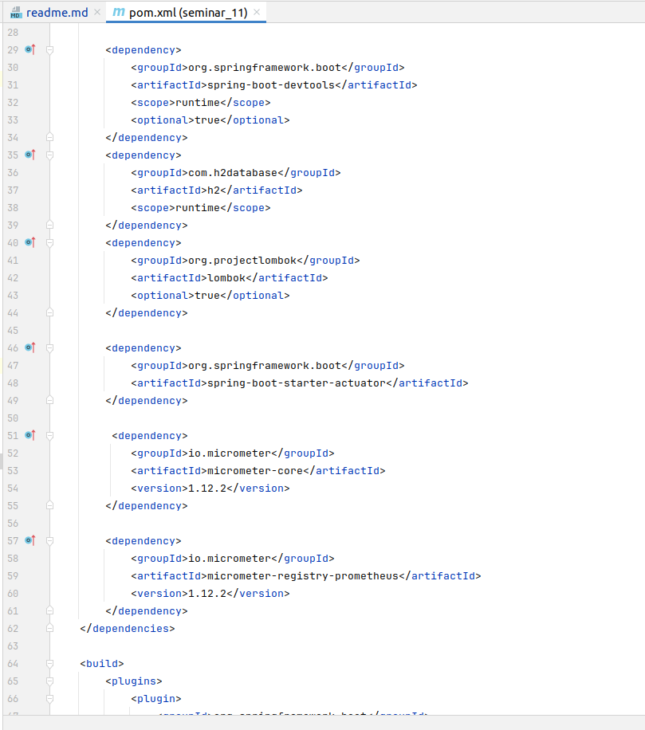
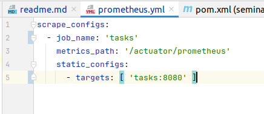
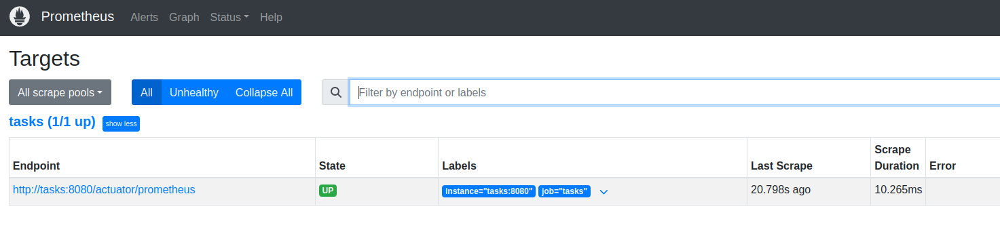
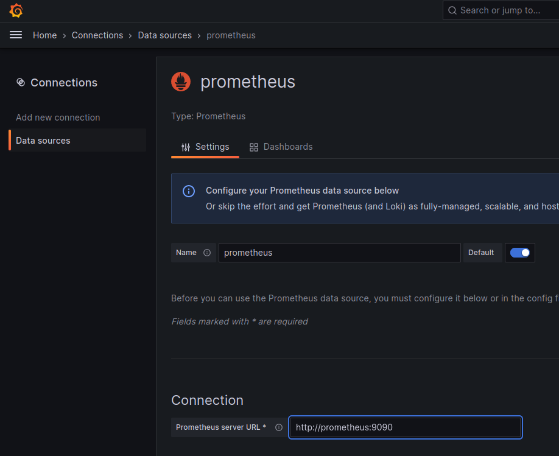
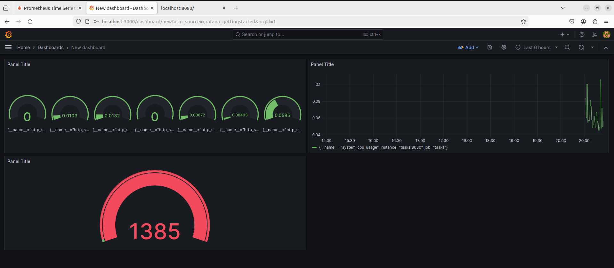

## Условия задание:

По примерам показанным на семинаре:

1) Подключить к своему проекту зависимости actuator, registry-prometheus и micrometer.
2) Установить и подключить к проекту prometheus
3) Установить и подключить Grafana. В Grafana добавить пару точек контроля (Например: процессное время приложения и
   количество запросов)

### Формат сдачи:

- **_проект с добавленными зависимостями_**

- **_файл настройки prometheus_**

**Примечание:** _Так как все взаимодействие идет внутри docker-a, то и настройку **target (tasks:8080)**, нужно писать
ссылку на контейнер, а не **localhost:8080**_

- **_скриншот Grafana с добавленными контрольными точками._**

**Примечание:** Настройку **Connection**, также прописываем название контейнера:порт **(http://prometheus:9090)**

